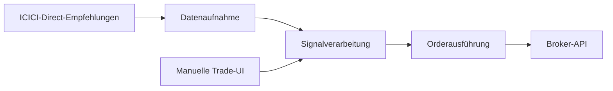

::: {.project-detail}

::: {.project-hook}
Entwickelte ein End-to-End-Handelssystem, das Handelsempfehlungen von ICICI Direct programmatisch repliziert — und erweiterte es um eine benutzerdefinierte Oberfläche für manuelle Trades und Overrides.
:::

## Überblick

Was als Automatisierung zur Spiegelung von Broker-Empfehlungen begann, wurde zu einem vollständigen Produkt: einer Backend-Pipeline, die Signale aufnimmt, verarbeitet und Orders ausführt — plus einem Frontend, das mir volle Kontrolle gibt, wenn ich manuell eingreifen möchte.

## Phase 1 — Automatisierte Replikation

::: {.phase-block}
#### Phase 1 · Automatisierte Pipeline

<ul class="star-list">
<li><strong>Situation:</strong> ICICI Direct veröffentlicht Handelsempfehlungen, die schnelle, konsistente Ausführung erfordern.</li>
<li><strong>Aufgabe:</strong> Ein System bauen, das diese Empfehlungen empfängt und entsprechende Trades programmatisch platziert.</li>
<li><strong>Maßnahme:</strong> Eine Pipeline mit drei Stufen entworfen — <strong>Datenaufnahme</strong>, <strong>Verarbeitung</strong> (Parsen, Validieren, Zuordnung zu Orders) und <strong>Ausführung</strong> (Trades über die Broker-API).</li>
<li><strong>Ergebnis:</strong> Trades werden automatisch mit minimaler Latenz repliziert, ohne manuelle Ordereingabe für jede Empfehlung.</li>
</ul>
:::

## Phase 2 — Manuelle Trade-Oberfläche

::: {.phase-block}
#### Phase 2 · Produkt-Upgrade

<ul class="star-list">
<li><strong>Situation:</strong> Die vollautomatische Replikation funktionierte gut, aber ich musste manchmal Trades manuell hinzufügen oder Systementscheidungen überschreiben.</li>
<li><strong>Aufgabe:</strong> Das System um eine Benutzeroberfläche für manuelle Trades und Eingriffe erweitern.</li>
<li><strong>Maßnahme:</strong> Ein benutzerdefiniertes Frontend auf der bestehenden Pipeline gebaut, um Trades einzugeben, ausstehende Orders zu prüfen und automatische Aktionen bei Bedarf zu überschreiben.</li>
<li><strong>Ergebnis:</strong> Ein hybrides System — standardmäßig automatisiert, bei Bedarf manuell steuerbar. Die UI machte aus einem Backend-Skript ein nutzbares Handelswerkzeug.</li>
</ul>
:::

{.project-screenshot fig-alt="Handelssystem-UI mit manueller Trade-Eingabe"}

## Architektur

## Technologie

::: {.tech-stack}
Python
API-Integration
Web-UI
Automatisierter Handel
ICICI Direct
:::

:::
