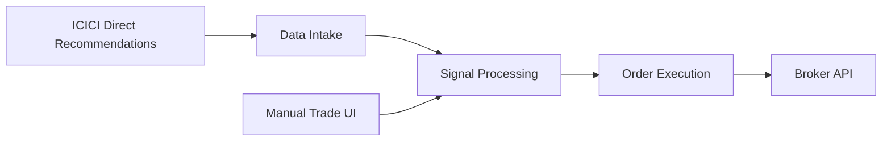

::: {.project-detail}

::: {.project-hook}
Built an end-to-end trading system that programmatically replicates trade recommendations from ICICI Direct — then extended it with a custom UI for manual trade entry and overrides.
:::

## Overview

What started as an automation to mirror broker recommendations evolved into a full product: a backend pipeline that ingests signals, processes them, and executes orders — plus a frontend that gives me full control when I want to intervene manually.

## Phase 1 — Automated Replication

::: {.phase-block}
#### Phase 1 · Automated Pipeline

<ul class="star-list">
<li><strong>Situation:</strong> ICICI Direct publishes trade recommendations that require fast, consistent execution to be useful.</li>
<li><strong>Task:</strong> Build a system that receives these recommendations and places corresponding trades programmatically, without manual intervention.</li>
<li><strong>Action:</strong> Designed a pipeline with three stages — <strong>data intake</strong> (capturing recommendations from ICICI Direct), <strong>processing</strong> (parsing, validating, and mapping signals to orders), and <strong>execution</strong> (placing trades via the broker API).</li>
<li><strong>Result:</strong> Trades are replicated automatically with minimal latency, removing the friction of manual order entry for every recommendation.</li>
</ul>
:::

## Phase 2 — Manual Trade UI

::: {.phase-block}
#### Phase 2 · Product Upgrade

<ul class="star-list">
<li><strong>Situation:</strong> Fully automated replication worked well, but I sometimes needed to add trades manually or override the system's decisions.</li>
<li><strong>Task:</strong> Extend the system with a user interface for manual trade entry and intervention.</li>
<li><strong>Action:</strong> Built a custom frontend UI on top of the existing pipeline, allowing me to input trades, review pending orders, and override automated actions when needed.</li>
<li><strong>Result:</strong> A hybrid system — automated by default, manually controllable when context demands it. The UI turned a backend script into a usable trading tool.</li>
</ul>
:::

{.project-screenshot fig-alt="Trading system UI showing manual trade entry interface"}

## Architecture

## Where the idea came from

Two examples stayed with me: Mohnish Pabrai’s account of learning by studying Warren Buffett’s decisions, and an investing video by Shankar Nath about systematic imitation. I translated that curiosity into a narrower experiment: could a transparent system reproduce published ICICI Direct recommendations while preserving the ability to review and intervene?

This project is separate from Systematick. It tests execution and control around an external recommendation stream; Systematick is a venture for defining and testing an investor’s own philosophy.

## Process desk

::: {.process-desk}
::: {.process-card}
01 · Source

**Broker and analyst reports**

{fig-alt="Stock Reports Plus example used as an input to systematic investment research"}
:::

::: {.process-card}
02 · Rules

**Trading-rules spreadsheet**

The real rules sheet will appear here after public-view access is confirmed. It also records the naming origin of Systematick.
:::

::: {.process-card}
03 · Interface

{fig-alt="Manual trade-entry and override interface"}
:::
:::

## Tech Stack

::: {.tech-stack}
Python
API Integration
Web UI
Automated Trading
ICICI Direct
:::

:::
