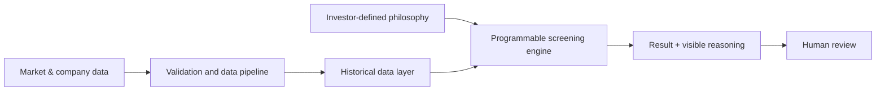

::: {.project-detail}

::: {.project-hook}
Systematick began with a question: **can good investment decisions become more systematic, transparent, and repeatable?**
:::

<strong>Status:</strong> Independent venture in development. Company registration is planned but not yet claimed.

## The problem

Most investment software is designed to deliver answers: a rating, a signal, or a list of stocks. I was more interested in the process that produces an answer.

An investor may have a clear philosophy in their head—quality, valuation, resilience, or some combination of the three—but applying it consistently across years of company data is difficult. The rules drift. Sources disagree. Past decisions become hard to reconstruct.

Systematick is my attempt to turn that reasoning into a process that can be inspected, tested, and improved.

## What I am building

The platform combines programmable screening logic with the data infrastructure needed to support it. The visible interface is only one layer. Much of the work has involved questions beneath it:

- How should years of financial and market data be stored efficiently?
- How should corporate actions alter historical series?
- Where should authentication and user-specific logic live?
- How can a result remain explainable after parts of the workflow are automated?
- Which architectural decisions remain sensible if the project grows?

Those questions led me into Parquet, DuckDB, Azure storage, authentication, schema design, and deployment. The technologies changed as the architecture improved. The objective remained stable.

## Architecture

## What changed in my thinking

I originally treated data as an input to the product. I now see it as part of the product.

An elegant screening rule is not useful if the historical data is inconsistent, a corporate action is mishandled, or the user cannot trace a number back to its source. Data quality must come before analytics, and transparency must come before automation.

## From project to venture

Systematick is not an extension of my ICICI Direct automation. The earlier system explored disciplined execution of external recommendations. Systematick begins one level earlier: how an investor defines a philosophy, tests it against reliable history, and preserves the reasoning behind each decision.

The venture now includes product positioning, infrastructure choices, a public domain, and the work required to turn a personal tool into something another investor can understand and use.

## Process desk

::: {.process-desk}
::: {.process-card}
01 · Rough product document

**Defining the problem before the interface**

An early working document records the movement from “stock screener” toward a transparent decision system. A public excerpt will be added once access is confirmed.
:::

::: {.process-card}
02 · Architecture

**Data became part of the product**

Parquet, DuckDB, cloud storage, authentication, and schema design emerged from the need to make historical decisions reproducible.
:::

::: {.process-card}
03 · Working product

{fig-alt="Systematick working interface"}
:::
:::

## If I rebuilt the first version today

I would begin with a smaller set of investor decisions and design the explanation layer alongside the calculation layer. It is easier to add another metric later than to make an opaque system explainable after the fact.

## Working principles

::: {.tech-stack}
Process before prediction
Data quality before analytics
Transparency before automation
Architecture before implementation
:::

::: {.project-cta}
[Visit Systematick](https://systematick.in){.btn-project target="_blank"}
[View the repository](https://github.com/satvikraman/systematick){.btn-project .btn-project-secondary target="_blank"}
:::

:::
